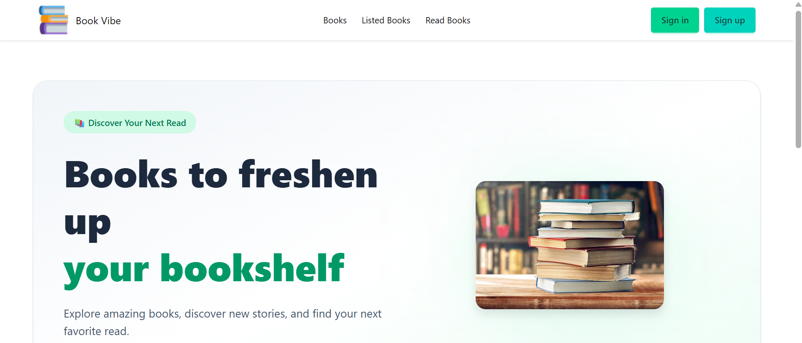

# 📚 Book Vibe

**Book Vibe** is a modern book discovery web application built with **Next.js**. It allows users to explore books, view book information, and organize books they are interested in reading.





🔗 **Live Website:** https://book-vibe-ak5e.vercel.app/

---

## 📖 Project Overview

Book Vibe is a book management and discovery application where users can explore a collection of books and view detailed information about each book.

The project was built to practice modern **Next.js**, **React**, **TypeScript**, **Tailwind CSS**, and state management concepts while creating a clean and user-friendly interface.

---

## 🚀 Technologies Used

* **Next.js** – React framework for building the application
* **React.js** – Building reusable UI components
* **TypeScript** – Type-safe development
* **Tailwind CSS** – Styling and responsive design
* **DaisyUI** – Pre-built UI components
* **Context API** – Managing application state
* **Vercel** – Deployment

---

## ✨ Main Features

### 📚 Book Collection

* Browse available books
* View books in a clean and responsive layout
* Display important book information such as:

  * Book name
  * Author
  * Rating
  * Review
  * Total pages
  * Category
  * Publisher
  * Publishing year
  * Tags

### 📖 Book Details

* View detailed information about a selected book
* Dynamic book details page
* Organized and responsive book information layout

### ❤️ Wishlist

* Add books to a wishlist
* View saved wishlist books
* Remove books from the wishlist

### 📕 Read List

* Add books to your read list
* Keep track of books you want to read or have selected

### 🎨 Responsive UI

* Mobile-friendly design
* Responsive layouts for different screen sizes
* Modern UI using Tailwind CSS and DaisyUI

### ⚡ Next.js Features

* Next.js App Router
* Dynamic routing
* Reusable components
* Server-side data fetching
* Optimized images
* Context-based state management

---

## 📦 Dependencies

The project uses the following main dependencies:

### Main Dependencies

```json
{
  "next": "Next.js",
  "react": "React",
  "react-dom": "React DOM"
}
```

### Styling

```text
tailwindcss
daisyui
```

### Development

```text
typescript
@types/react
@types/react-dom
@types/node
```

> **Note:** The exact versions of the dependencies are determined by the project's `package.json`.

---

## 💻 Run the Project Locally

Follow these steps to run Book Vibe on your local machine.

### 1. Clone the Repository

```bash
git clone <your-github-repository-url>
```

### 2. Go to the Project Folder

```bash
cd book-vibe
```

### 3. Install Dependencies

Using npm:

```bash
npm install
```

Or using yarn:

```bash
yarn install
```

### 4. Create Environment Variables

Create a `.env.local` file in the root of the project:

```env
NEXT_PUBLIC_SERVER_BASE_URL=http://localhost:3000
```

Make sure the environment variable matches your local data/API setup.

### 5. Start the Development Server

```bash
npm run dev
```

### 6. Open the Website

Visit:

```text
http://localhost:3000
```

---

## 📁 Project Structure

A simplified project structure:

```text
book-vibe/
│
├── public/
│   ├── images/
│   └── booksData.json
│
├── src/
│   ├── app/
│   │   ├── books/
│   │   ├── book/
│   │   ├── wishlist/
│   │   ├── read/
│   │   ├── layout.tsx
│   │   └── page.tsx
│   │
│   ├── components/
│   │   ├── Navbar/
│   │   ├── Footer/
│   │   ├── BookCard/
│   │   └── ...
│   │
│   └── context/
│       └── BookContext.tsx
│
├── .env.local
├── package.json
├── tsconfig.json
└── README.md
```

---

## 🌐 Live Demo

You can explore the deployed application here:

**[Book Vibe](https://book-vibe-ak5e.vercel.app/)**

---

## 👩‍💻 Author

**Wazida Momtaz Esha**

Learning and building with modern web technologies 🚀

---

⭐ If you like this project, feel free to give the repository a star!
